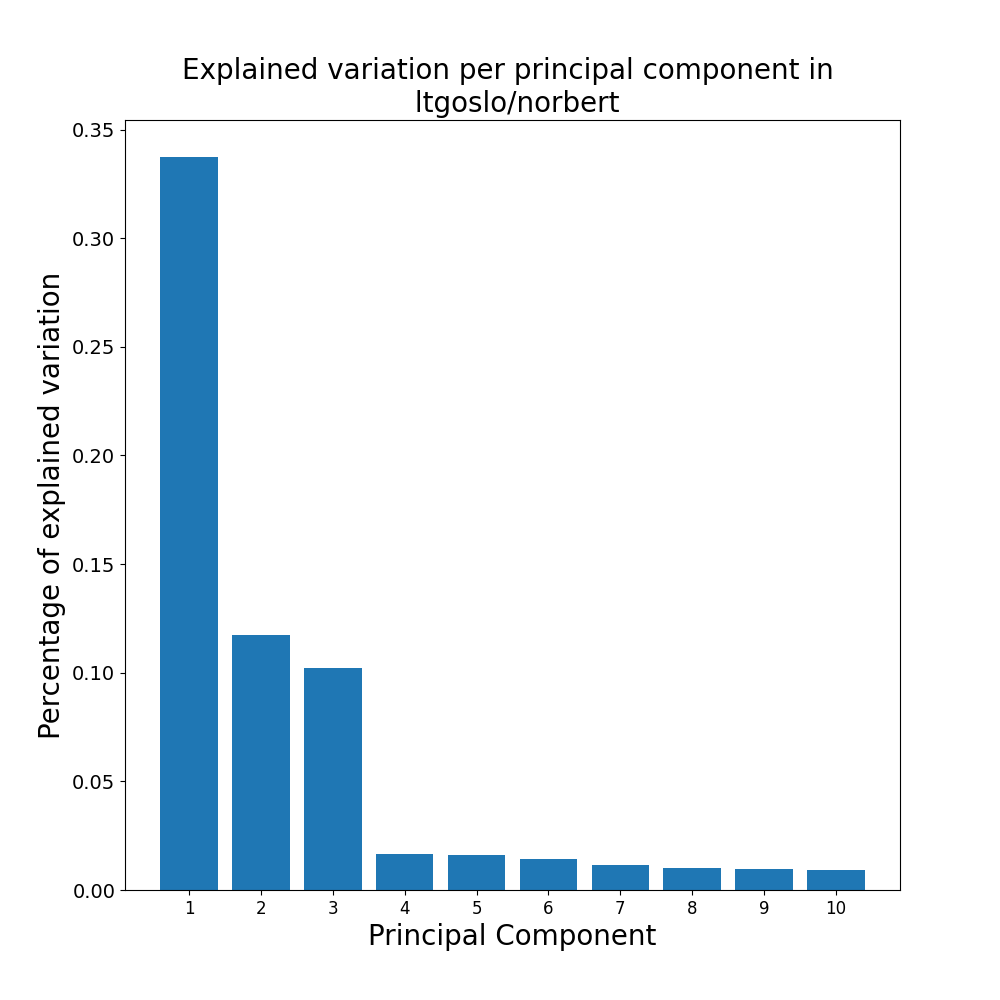

# master-thesis
## Count pronouns in Norwegian Language Model NorBERT
NorBERT is trained on 
* Norsk Aviskorpus; 1.7 billion words;
* Bokmål Wikipedia; 160 million words;
* Nynorsk Wikipedia; 40 million words;

The corpus files are excluded from the code due to size and easy availability online. We collected this data on the 20th of January. 

To count the number of pronouns in Norsk Aviskorpus:
1. Download [Norsk Aviskorpus](https://www.nb.no/sprakbanken/ressurskatalog/oai-nb-no-sbr-4/) 
2. Unzip .tar.gz and .gz files
3. Replace the variable in "rootdir" in main() with the path to your Aviskorpus data
4. Run experiments/pronoun_count/pronoun_count_norsk_aviskorpus.py

To count the number of pronouns in Wikipedia:
1. Download [Bokmål Wikipedia](https://dumps.wikimedia.org/nowiki/latest/) and [Nynorsk Wikipedia](https://dumps.wikimedia.org/nnwiki/latest/) dumps with [segment wiki](https://github.com/RaRe-Technologies/gensim/blob/master/gensim/scripts/segment_wiki.py)
2. Replace the argument in pronoun_count/pronoun_count_in_wikipedia.py with the path to your wiki-dump-jsonfile
3. Run experiments/pronoun_count/pronoun_count_in_wikipedia.py 

To count the number of pronouns in Norwegian Colossal Corpus (NCC):
1. Clone the training set with git clone https://huggingface.co/datasets/NbAiLab/NCC
2. Create one large training file of all shards without unpacking cat NCC/data/train*.gz > onefile.json.gz
3. Unpack with gzip -d onefile.json.gz
4. Replace the argument in experiments/pronoun_count/pronount_count_in_norwegian_colossal_corpus.py with the path to your jsonfile
5. Run experiments/pronoun_count/pronount_count_in_norwegian_colossal_corpus.py

Our experiment was performed 20th of January and resulted in this count for the pronouns "han", "ham", "hun", "ho", "henne"
|  | NO-Wikipedia        | NN-Wikipedia           | Aviskorpus  |NCC  |
| -------------| ------------- |:-------------:| -----:|-----:|
| Female pronouns  | 254 752  | 62 667 | 2 304 084 |7 216 408|
| Male pronouns   | 918 999      | 239 107     |   7 539 723 |23 151 190|

This is the result for the count of the gendered words "mann", "kvinne", "gutt", "gut", "jente", "herre", "dame"
|  | NO-Wikipedia        | NN-Wikipedia           | Aviskorpus  | NCC |
| -------------| ------------- |:-------------:| -----:|-----:|
| Female pronouns  | 8 813  | 1 569 | 259 924 |432 580|
| Male pronouns   | 18 744      | 3 328     |   490 919 |1 613 404|

## Principal Component Analysis of NorBERT, NB-BERT and mBERT
The sentences used can be found in experiments/pca/sample_sentences.xlsx and can be changed to other sentences/target words on the same format. 
To analyze (plot) the principal componants: 
1. Fill inn for wanted variables in __main__ function in experiments/pca/find_gender_subspace.py 
2. Run xperiments/pca/find_gender_subspace.py
3. Plots will be saved in experiments/pca/plots/

Example of plot: Top 10 principal components from 'han', 'hun', 'jente' and 'gutt' in NorBERT embeddings calculated from sentences in sheet 'hun_han_alle' and 'jente_gutt_tilfeldig'

